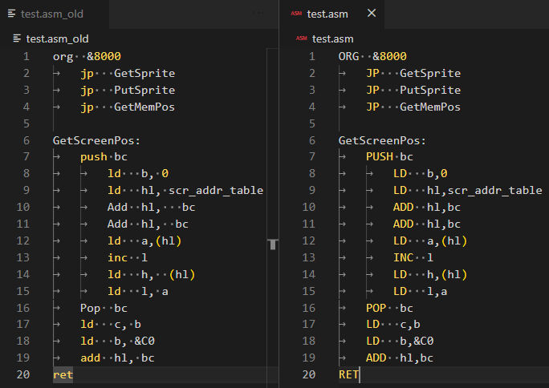

# AsmAlign
AsmAlign is a command line tool for format files written in asembly language. AsmAlign align the instructions and the arguments in the same column for better visualization.

## Usage 
```
asmAlign [options] <input file>
```

## Options
- **-i\<number>** Specifies the lenght of the instructions. It must be a value between 1 and 9. If doesnt specify, the default value is 4. 

- **-s\<number>** Specifies the separation between the instruction and the arguments. It must be a value between 1 and 9. If doesnt specify, the default value is 1. 

- **-u** Change all instructions to upper case. 

- **-t** Trim white spaces between arguments.

- **--usage** Show the usage information.

### Prebuilt options by architecture

- **--z80** For Z80 asembler. Equals -i4 -s1.

### Visual information
```
./asmAlign -i4 -s1
```


```
./asmAlign -i5 -s2
```


## Example

Using AsmAlign with the file test.asm

The program align the file and generates a backup file with the old content.

```
./asmAlign test.asm
```


Example with `-u` and `-t` options

```
./asmAlign test.asm -u -t
```
